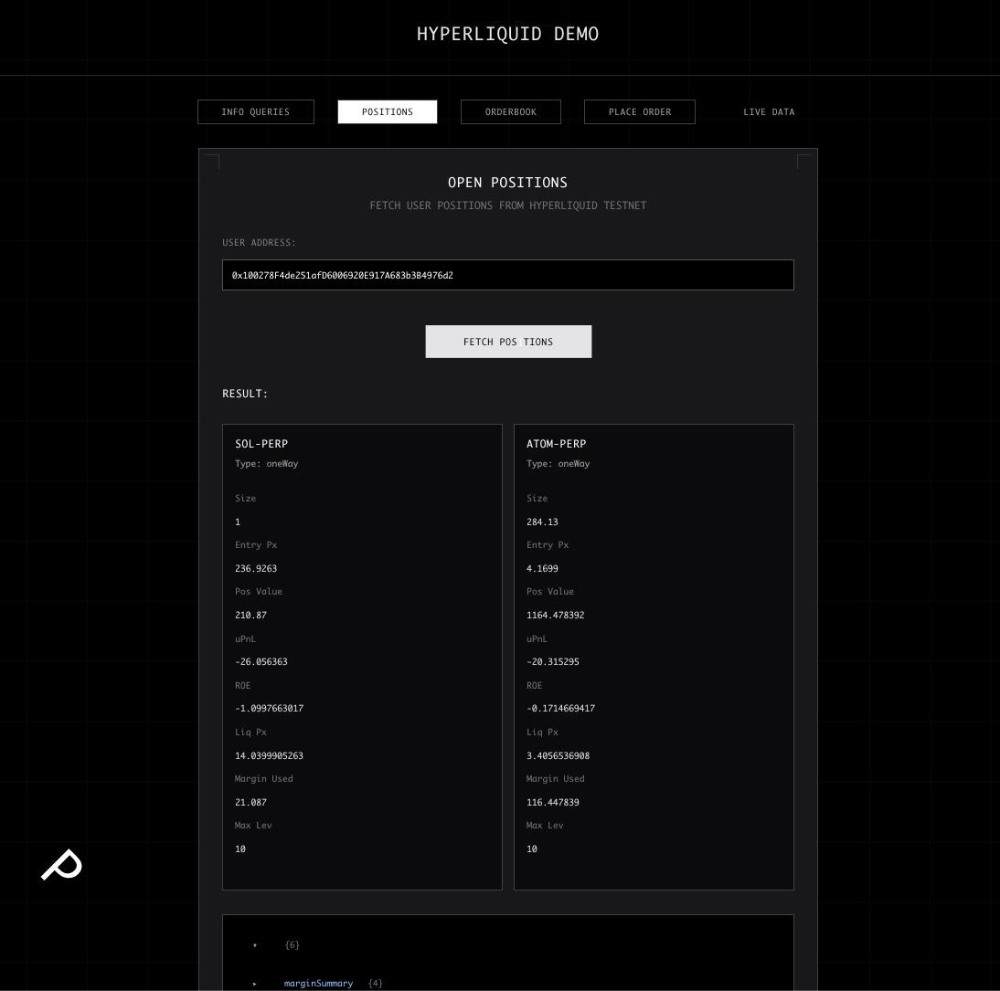
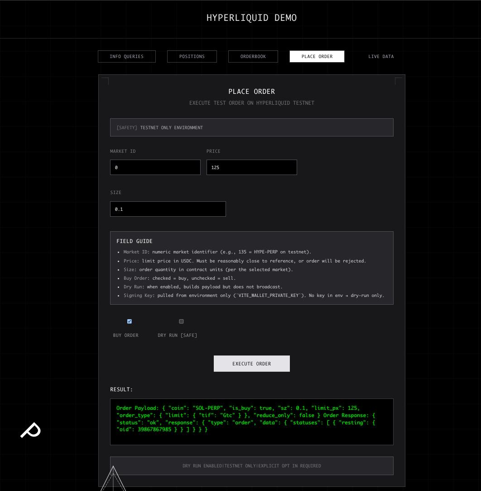
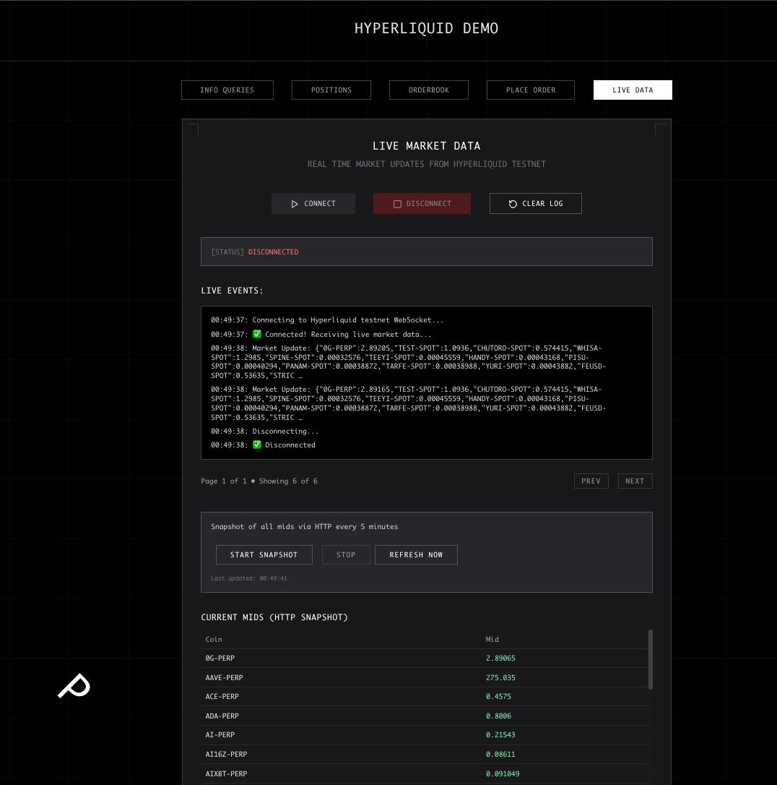
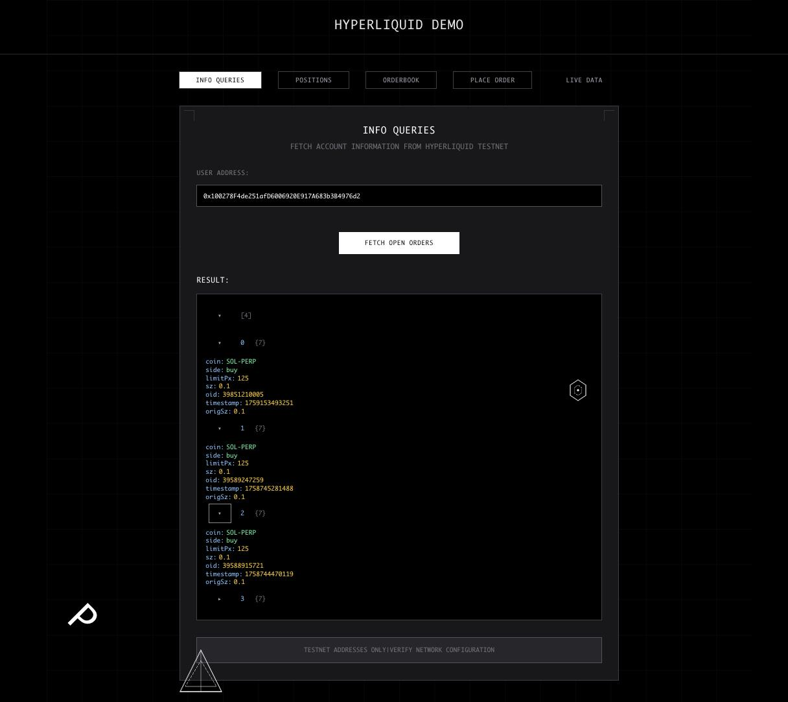
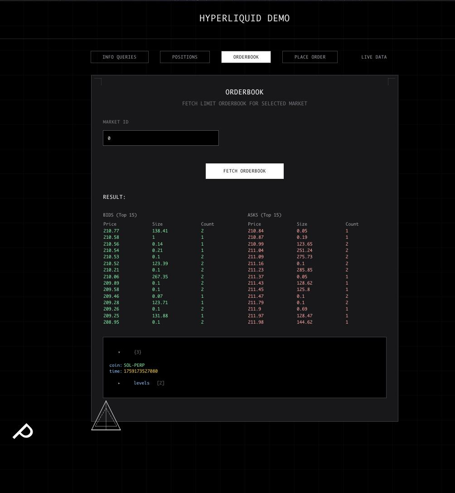

# hyperdemo — Hyperliquid Testnet Demo

A clean, modern React + Vite frontend that demonstrates practical usage of the Hyperliquid TypeScript SDK on testnet, with a focus on reliability, clarity, and developer experience.

### Highlights
- HTTP info queries: open orders, positions, orderbook
- WebSocket subscriptions: live market data streaming
- 5‑minute HTTP snapshots: market mids table (filters placeholder symbols)
- Dynamic market ID → symbol resolution from live meta
- Safe order placement: reads private key from env only
- Beautiful JSON viewer with collapsible sections for debugging
- Tailwind‑powered cyberpunk UI inspired by v0 by Vercel

### Tech Stack
- React 18, TypeScript, Vite
- Tailwind CSS 3.x + PostCSS (CJS config)
- Hyperliquid SDK (UMD bundle loaded in browser)

---

## App Structure (Panels)

- InfoPanel: Query and display open orders via HTTP. Uses `await sdk.connect()` and renders results with `JsonView`.
- OrderPanel: Place testnet orders using env‑provided private key. Resolves market ID → symbol dynamically.
- SubscriptionPanel: Live WS stream with paginated event feed and a 5‑minute HTTP snapshot of market mids (sortable, filtered).
- PositionsPanel: Robust position fetch with fallbacks (`perpetuals.getClearinghouseState`, `getUserPositions`, `userState`, `getUserState`).
- OrderbookPanel: L2 orderbook for a selected market (top bids/asks tables) using `getL2Book` or `getOrderbook`.

Panels are selectable from the top navigation in `src/App.tsx`.

---

## Quick Start

1) Frontend env

Copy `frontend/env.example` to `frontend/.env` and set at minimum:

```
HL_IS_TESTNET=true
# optional custom endpoints (must include "testnet")
# HL_API_BASE_URL=https://api.hyperliquid-testnet.xyz
# HL_WS_URL=wss://api.hyperliquid-testnet.xyz/ws

# testnet key only; UI reads key from env, never from input fields
# WALLET_PRIVATE_KEY=0x...
```

2) Install and run

```
cd frontend
npm install
npm run dev
```

Open the local URL from the terminal output.

---

## Screenshots

Images live in `screenshots/`:







Tip: On macOS, capture window screenshots with `Shift+Cmd+4`, then Space.

---

## Scripts

Frontend (in `frontend/`):

```
npm run dev       # start Vite dev server
npm run build     # type-check + production build
npm run preview   # preview built app
```

Node utilities (root, optional CLI samples):

```
npm run info      # example HTTP info query
npm run subs      # example WebSocket subscription
npm run order     # example order placement (dry-run by default)
```

---

## Market IDs (Testnet)

Markets are indexed by the live meta response; IDs can change over time. The app resolves symbols dynamically. If you’re unsure:

- Use the Live Data → Start Snapshot to list symbols
- Or fetch meta directly and map `index → name` (ensure `-PERP` suffix)

Example known IDs at time of writing:
- 0 = SOL-PERP
- 135 = HYPE-PERP

If you ever see “Unknown market id,” wait a moment and retry (meta is fetched and cached on demand) or refresh the page to rebuild the map.

---

## Troubleshooting

- Hyperliquid SDK not found in browser: ensure UMD script is loaded in `frontend/index.html` and access via `window.HyperliquidSDK`.
- PostCSS/Tailwind error about ESM plugin: use `postcss.config.cjs` and Tailwind 3.x (already configured).
- Positions function missing: SDK bundles differ; the app tries multiple fallbacks before showing an error.
- WS vs HTTP: WS for continuous streams; HTTP for periodic snapshots and one-off queries.

---

## Security Notes

- Testnet only. Don’t use mainnet keys here.
- Private key is read from `.env` at build/runtime and not exposed via input fields.
- Always confirm you’re pointing to testnet endpoints.

---

## License

MIT

---

Repository: `https://github.com/zeeshan8281/hyper-demo`
